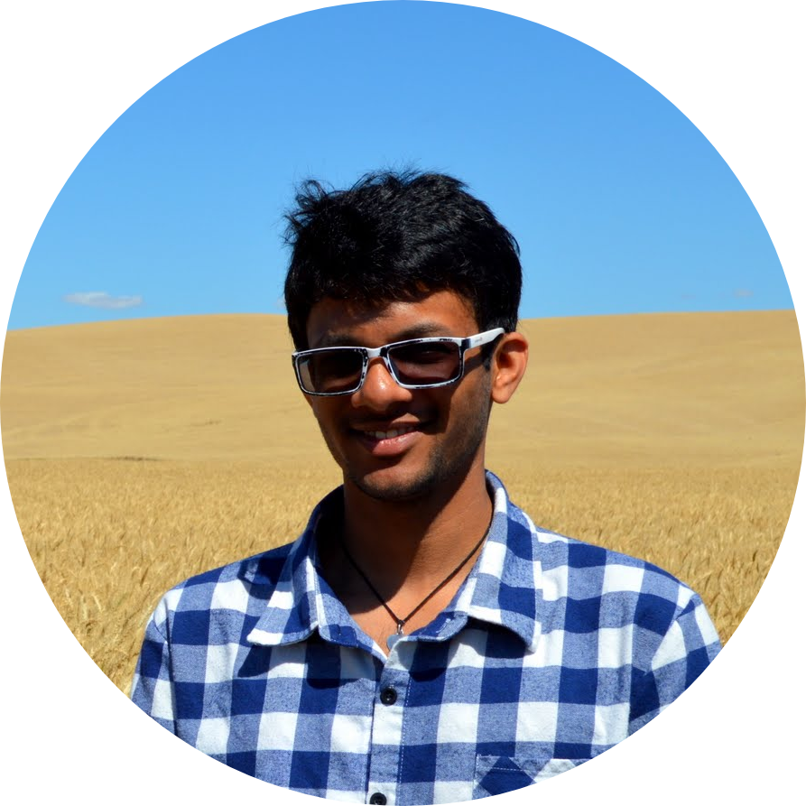

 

## About

I'm a researcher working mainly in the areas of computational social science and computational humanities. My interests are in modeling language change and, in particular, the social dynamics of language change. This work often involves the use of methods in unsupervised machine learning, natural language processing, and network science. My thesis is on using computational methods to model and quantify network influence in the process of language change.

I'm currently a PhD candidate in Computer Science in the [School of Interactive Computing](https://www.ic.gatech.edu/) at [Georgia Institute of Technology](https://www.gatech.edu/), where I'm advised by [Jacob Eisenstein](https://jacobeisenstein.github.io/). I hold a Masters in Computer Science also from Georgia Institute of Technology. I have been a research intern at places like [Microsoft Research](https://www.microsoft.com/en-us/research/), [Max Plank Institute of Software Systems](https://www.mpi-sws.org/), and [Information Sciences Institute](https://www.isi.edu/).

  

## News

<table style="width:100%">
  <tr>
    <td width="15%">Aug 2020</td>
    <td>Our paper, <i>Follow the Leader: Documents on the Leading Edge of Semantic Change Get More Citations</i> <a href="https://arxiv.org/pdf/1909.04189.pdf">[Preprint]</a>, is conditionally accepted to <a href="https://asistdl.onlinelibrary.wiley.com/journal/23301643">JASIST</a>. Joint work with Kristina Lerman and Jacob Eisenstein.</td>
  </tr>
  <tr>
    <td width="15%">May 2020</td>
    <td>Presented my thesis proposal. I'm now a PhD candidate! </td>
  </tr>
    <tr>
    <td width="15%">May 2020</td>
    <td>New <a href=""> preprint </a> of our work on counter hate speech in COVID19 discourse on Twitter.</td>
  </tr>
  <tr>
    <td width="15%">Jan 2020</td>
    <td>Presented the findings from our <a href="https://arxiv.org/pdf/1909.04189.pdf">paper</a> at the Behavioral Insights from Text Conference, UPenn.</td>
  </tr>
</table>

 

## Selected Publications

- Sandeep Soni, Lauren Klein, and Jacob Eisenstein (Under review), **Lexical Semantic Leadership Networks In Nineteenth Century Abolitionist Newspapers**, [PDF]()

- Sandeep Soni, Kristina Lerman, and Jacob Eisenstein (2020), **Follow the Leader: Documents on the Leading Edge of Semantic Change Get More Citations**, *Journal of the Association for Information Science and Technology*, [PDF](https://arxiv.org/pdf/1909.04189.pdf)

- Rahul Goel, Sandeep Soni, Naman Goyal, John Paparizzos, Hanna Wallach, Fernando Diaz, and Jacob Eisenstein (2016), **The Social Dynamics of Language Change in Online Networks**, *Social Informatics*, [PDF](https://arxiv.org/pdf/1609.02075.pdf)

- Sandeep Soni, Tanushree Mitra, Eric Gilbert, and Jacob Eisenstein (2014), **Modeling Factuality Judgments in Social Media Text**, *Association of Computational Linguistics*, [PDF](https://www.aclweb.org/anthology/P14-2068.pdf)

<!-- ## Teaching

Fall 2020: TA for CS 7650/4650 [Natural Language Processing]()

Fall 2019: TA for CS 6474/4803 [Social Computing](http://www.munmund.net/CS6474_Fall2019.html)  
  
Fall 2015: TA for CS 7650/4650 [Natural Language Processing](https://github.com/jacobeisenstein/gt-nlp-class)

  -->